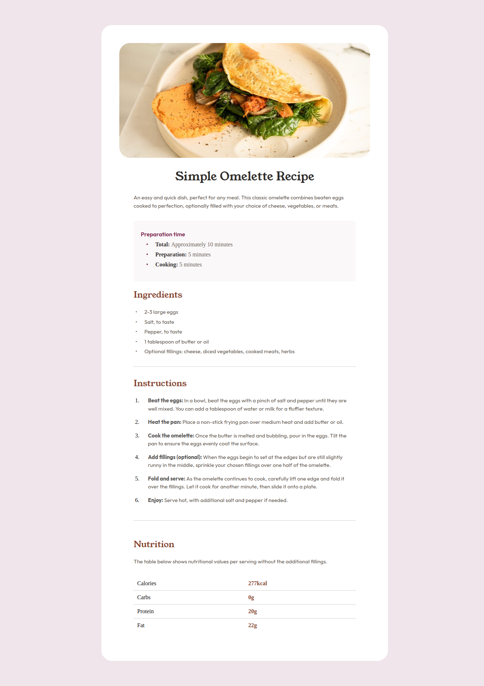

# Frontend Mentor - Recipe page solution

This is a solution to the [Recipe page challenge on Frontend Mentor](https://www.frontendmentor.io/challenges/recipe-page-KiTsR8QQKm). Frontend Mentor challenges help you improve your coding skills by building realistic projects.

## Table of contents

- [Overview](#overview)
  - [The challenge](#the-challenge)
  - [Screenshot](#screenshot)
  - [Links](#links)
- [My process](#my-process)
  - [Built with](#built-with)
  - [What I learned](#what-i-learned)
- [Author](#author)

## Overview

A website that shows a recipe for tortilla.
It is a simple and organized design.
Little CSS, but style implementation, custom CSS.

### The challenge

Users should be able to:

- View the optimal layout for the site depending on their device's screen size
- You will see an optimal display of fonts and images, new colors implemented.

### Screenshot

### Links

- Solution URL: [GitHub](https://github.com/ronitzdev/recipe-page)
- Live Site URL: [Live](https://recipe-page-ronitzdev.netlify.app/)

## My process

### Built with

- Semantic HTML5 markup
- CSS custom properties
- CSS Grid
- Mobile-first workflow

### What I learned

I focused on the structure part rather than responsive, and creating a structure that does not need CSS styles as much.
Optimizing small changes to get closer to the design, visually checking between the design and what is currently developed.

## Author

- GitHub - [ronitzdev](https://github.com/ronitzdev)
- Frontend Mentor - [@ronitzdev](https://www.frontendmentor.io/profile/ronitzdev)
- LinkedIn - [@ronitzdev](https://www.linkedin.com/in/ronitzdev/)
